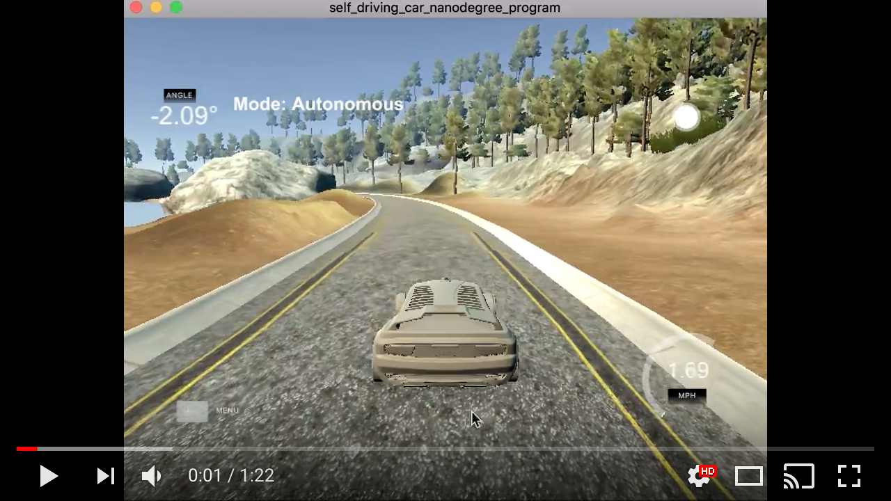

## About PID controller

The PID controller considers only three inputs:

* Offset from center of the road (Proportional)
* Average offset (Integral)
* How fast the offset is changing (Derivative)

Error is an input variable for the controller:

_cte = desired_state - measured_state_

With the proportional band (_P_) only, the PID controller output is proportional to the cte. It takes into account only the present value of cte and turns the car in the right direction to stay on track.

Integral term (_I_) takes into account the integral of cte over the past time. It is used to reduce systematic bias.

With derivative (_D_) part, the controller output is proportional to the rate of change of cte (its derivative). The parameter is used to reduce overshooting and dump oscillations caused by _P_.

While the PID controller is easy to implement, but it is not so easy to tune.

## How it was tuned

I tuned the _P_, _I_, and _D_ coefficients manually, changing their values in small increments and checking if vehicle performance improved or degraded with each small change. I found it helpful to start with low speeds and gradually increase the
vehicle speed as the parameters improved.

## Dependencies

* cmake >= 3.5
 * All OSes: [click here for installation instructions](https://cmake.org/install/)
* make >= 4.1
  * Linux: make is installed by default on most Linux distros
  * Mac: [install Xcode command line tools to get make](https://developer.apple.com/xcode/features/)
  * Windows: [Click here for installation instructions](http://gnuwin32.sourceforge.net/packages/make.htm)
* gcc/g++ >= 5.4
  * Linux: gcc / g++ is installed by default on most Linux distros
  * Mac: same deal as make - [install Xcode command line tools]((https://developer.apple.com/xcode/features/)
  * Windows: recommend using [MinGW](http://www.mingw.org/)
* [uWebSockets](https://github.com/uWebSockets/uWebSockets) == 0.13, but the master branch will probably work just fine
  * Follow the instructions in the [uWebSockets README](https://github.com/uWebSockets/uWebSockets/blob/master/README.md) to get setup for your platform. You can download the zip of the appropriate version from the [releases page](https://github.com/uWebSockets/uWebSockets/releases). Here's a link to the [v0.13 zip](https://github.com/uWebSockets/uWebSockets/archive/v0.13.0.zip).
  * If you run OSX and have homebrew installed you can just run the ./install-mac.sh script to install this
* Simulator. You can download these from the [project intro page](https://github.com/udacity/CarND-PID-Control-Project/releases) in the classroom.

## Basic Build Instructions

1. Clone this repo.
2. Make a build directory: `mkdir build && cd build`
3. Compile: `cmake .. && make`
4. Run it: `./pid`. 

## Editor Settings

We've purposefully kept editor configuration files out of this repo in order to
keep it as simple and environment agnostic as possible. However, we recommend
using the following settings:

* indent using spaces
* set tab width to 2 spaces (keeps the matrices in source code aligned)

## Code Style

Please (do your best to) stick to [Google's C++ style guide](https://google.github.io/styleguide/cppguide.html).

## Hints!

* You don't have to follow this directory structure, but if you do, your work
  will span all of the .cpp files here. Keep an eye out for TODOs.

